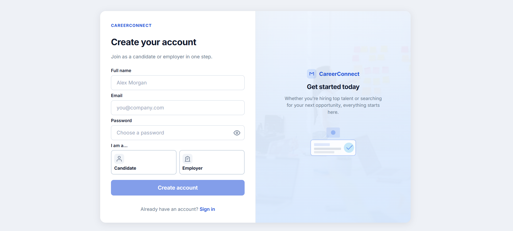
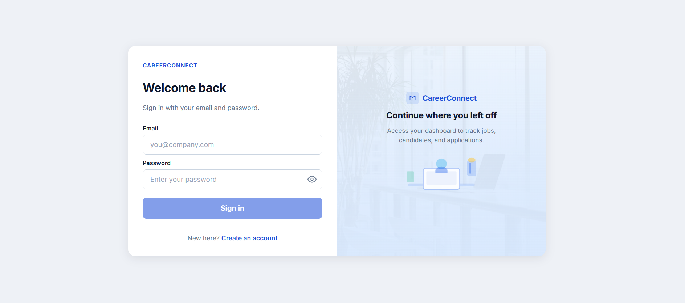
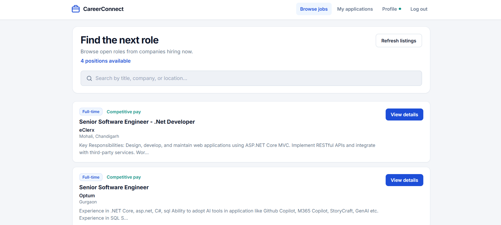
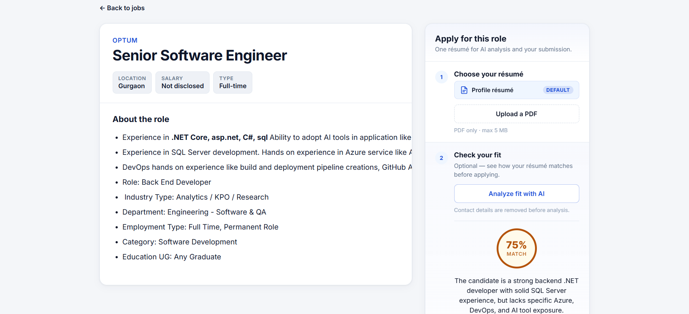
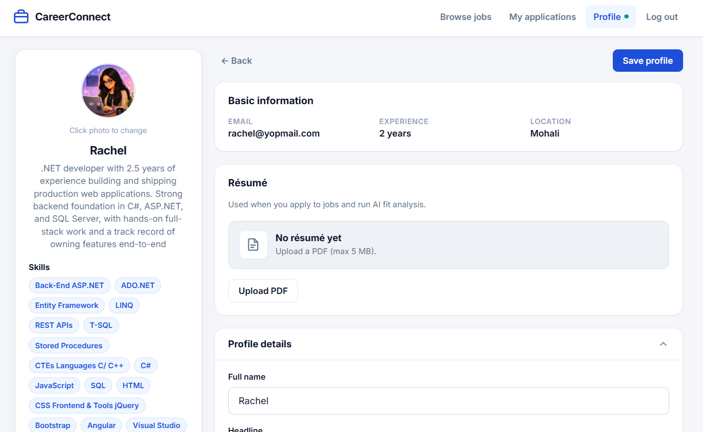

# Job Portal

Full-stack job portal where **candidates** browse jobs, upload a résumé, run **AI fit analysis**, and apply — and **recruiters** post listings and manage applicants.

**Repository:** [github.com/Anchal1605/JobPortalWebsite](https://github.com/Anchal1605/JobPortalWebsite)
**Live demo:** _Add your Vercel URL here after deploy_

---

## Features

| Area | What it does |
|------|----------------|
| **Auth** | Register / login with JWT; separate **Candidate** and **Recruiter** roles |
| **Jobs** | Browse listings, search, view job details |
| **Applications** | Apply with profile résumé; track status on *My applications* |
| **Recruiter tools** | Create / edit / delete jobs; view applicants per job |
| **Profiles** | Candidate profile (photo, skills, PDF résumé); employer company profile |
| **AI match** | Gemini-powered job–résumé fit score with cached results |
| **Files** | Avatar, company logo, and résumé upload (PDF) |

---

## Screenshots

| | |
|:---:|:---:|
| **Sign up** | **Log in** |
|  |  |
| **Home — job listings** | **Job detail — AI match & apply** |
|  |  |
| **Candidate profile** | |
|  | |

_More screenshots (e.g. recruiter applicants) can be added to `docs/screenshots/` later._

---

## Tech stack

| Layer | Technologies |
|-------|----------------|
| **Backend** | ASP.NET Core 8, EF Core, PostgreSQL, JWT, BCrypt, Swagger |
| **Frontend** | Angular 21, standalone components, signals, route guards, HTTP interceptor |
| **AI** | Google Gemini (job–résumé matching, PDF text extraction) |
| **DevOps** | Docker, GitHub (CI-ready), deploy targets: Vercel + Render + Neon |

---

## Project structure

```
JobPortalWebsite/
├── backend/JobPortalWebsite/JobPortal.API/   # .NET 8 Web API
├── frontend/                                  # Angular 21 SPA
├── docs/screenshots/                          # README images (you add these)
└── README.md
```

---

## Local setup

### Prerequisites

- [.NET 8 SDK](https://dotnet.microsoft.com/download)
- [Node.js 20+](https://nodejs.org/)
- PostgreSQL ([Neon](https://neon.tech) or [Supabase](https://supabase.com) free tier works)

### 1. Backend

```powershell
cd backend\JobPortalWebsite\JobPortal.API
copy appsettings.Development.example.json appsettings.Development.json
```

Edit **`appsettings.Development.json`** (never commit this file):

| Setting | Example |
|---------|---------|
| `ConnectionStrings:DefaultConnection` | Your Neon/Supabase connection string |
| `Jwt:Key` | Random string, **32+ characters** |
| `FileStorage:PublicBaseUrl` | `https://localhost:7011` |
| `Llm:ApiKey` | Gemini API key (optional; needed for AI match) |

Apply migrations and run:

```powershell
dotnet ef database update
dotnet run
```

- API: `https://localhost:7011`
- Swagger: `https://localhost:7011/swagger`

### 2. Frontend

```powershell
cd frontend
npm install
ng serve
```

Open **http://localhost:4200**

---

## Deploy (free tier)

| Part | Host | Notes |
|------|------|--------|
| Database | [Neon](https://neon.tech) | PostgreSQL |
| API | [Render](https://render.com) | Use `backend/JobPortalWebsite/JobPortal.API/Dockerfile` |
| Frontend | [Vercel](https://vercel.com) | Root directory: **`frontend`** |

### Render environment variables

| Key | Value |
|-----|--------|
| `ConnectionStrings__DefaultConnection` | Neon connection string |
| `Jwt__Key` | Long secret (32+ chars) |
| `Jwt__Issuer` | `JobPortalAPI` |
| `Jwt__Audience` | `JobPortalClient` |
| `ASPNETCORE_ENVIRONMENT` | `Production` |
| `FileStorage__PublicBaseUrl` | `https://<your-api>.onrender.com` |
| `Cors__AllowedOrigins__0` | `https://<your-app>.vercel.app` |
| `Llm__ApiKey` | Gemini API key |
| `Llm__Model` | `gemini-2.0-flash` |

### After Render is live

1. Run migrations against Neon:

   ```powershell
   cd backend\JobPortalWebsite\JobPortal.API
   $env:ConnectionStrings__DefaultConnection="<neon-connection-string>"
   dotnet ef database update
   ```

2. Set **`apiUrl`** in `frontend/src/environments/environment.production.ts` to your Render URL.

3. Deploy Vercel, then paste the Vercel URL at the top of this README under **Live demo**.

---

## API overview

| Controller | Examples |
|------------|----------|
| `Auth` | `POST /api/auth/register`, `POST /api/auth/login` |
| `Jobs` | `GET /api/jobs`, `POST /api/jobs` (recruiter) |
| `Applications` | `POST /api/applications`, `GET /api/applications/mine` |
| `Profiles` | `GET /api/profiles/me`, `POST /api/profiles/me/resume` |
| `Ai` | `POST /api/ai/match/{jobId}` |

Full interactive docs: `/swagger` when the API is running.

---

## Resume highlights

Use these on your CV (edit as you like):

- Built a full-stack job portal with **ASP.NET Core 8**, **Angular 21**, and **PostgreSQL** with JWT role-based auth.
- Implemented **REST APIs** for jobs, applications, profiles, and file uploads with **EF Core** migrations.
- Added **AI job–résumé matching** (Gemini) with PDF parsing and response caching.
- Designed responsive **Angular** UI with route guards, profile management, and recruiter applicant workflows.
- Containerized the API with **Docker**; documented deployment to **Vercel**, **Render**, and **Neon**.

---

## License

Personal / portfolio project — add a license if you open-source it (e.g. MIT).
